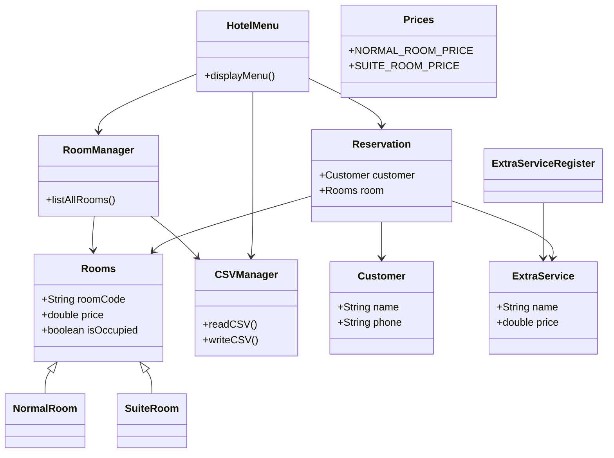

## UML DIAGRAM

```mermaid
classDiagram
    Rooms <|-- NormalRoom
    Rooms <|-- SuiteRoom
    
    HotelMenu --> RoomManager
    HotelMenu --> Reservation
    HotelMenu --> CSVManager
    
    Reservation --> Customer
    Reservation --> Rooms
    Reservation --> ExtraService
    
    RoomManager --> Rooms
    RoomManager --> CSVManager
    
    ExtraServiceRegister --> ExtraService
    
    class Rooms {
        +String roomCode
        +double price
        +boolean isOccupied
    }
    
    class NormalRoom
    class SuiteRoom
    
    class Customer {
        +String name
        +String phone
    }
    
    class Reservation {
        +Customer customer
        +Rooms room
    }
    
    class RoomManager {
        +listAllRooms()
    }
    
    class CSVManager {
        +readCSV()
        +writeCSV()
    }
    
    class ExtraService {
        +String name
        +double price
    }
    
    class HotelMenu {
        +displayMenu()
    }
    
    class Prices {
        +NORMAL_ROOM_PRICE
        +SUITE_ROOM_PRICE
    }
```
