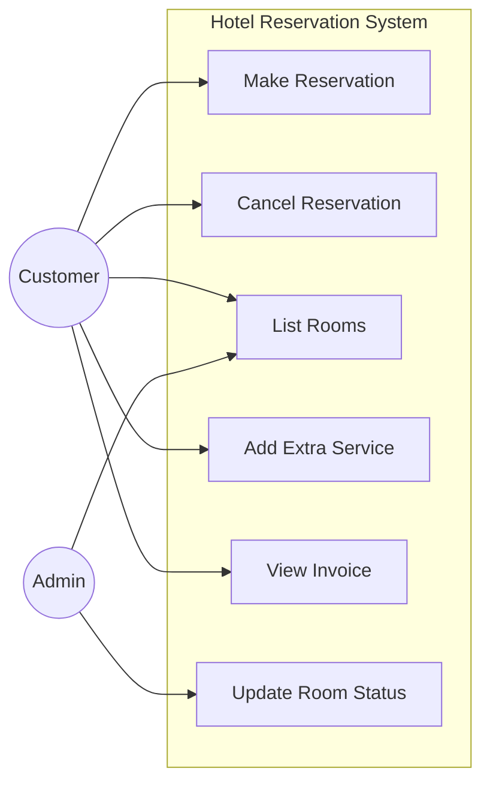

# Use Case Diagram

```mermaid
flowchart LR
    Customer((Customer))
    Admin((Admin))
    
    subgraph Hotel Reservation System
        UC1[Make Reservation]
        UC2[Cancel Reservation]
        UC3[List Rooms]
        UC4[Add Extra Service]
        UC5[View Invoice]
        UC6[Update Room Status]
    end
    
    Customer --> UC1
    Customer --> UC2
    Customer --> UC3
    Customer --> UC4
    Customer --> UC5
    
    Admin --> UC3
    Admin --> UC6
```