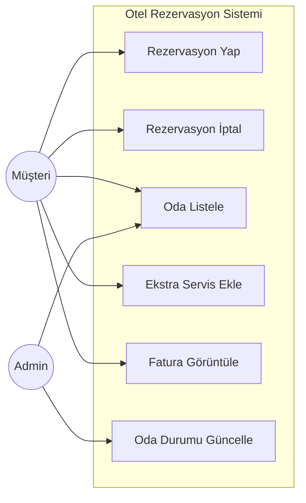

## Use Case Diagram

```mermaid
flowchart LR
    Customer((Müşteri))
    Admin((Admin))
    
    subgraph Otel Rezervasyon Sistemi
        UC1[Rezervasyon Yap]
        UC2[Rezervasyon İptal]
        UC3[Oda Listele]
        UC4[Ekstra Servis Ekle]
        UC5[Fatura Görüntüle]
        UC6[Oda Durumu Güncelle]
    end
    
    Customer --> UC1
    Customer --> UC2
    Customer --> UC3
    Customer --> UC4
    Customer --> UC5
    
    Admin --> UC3
    Admin --> UC6
```